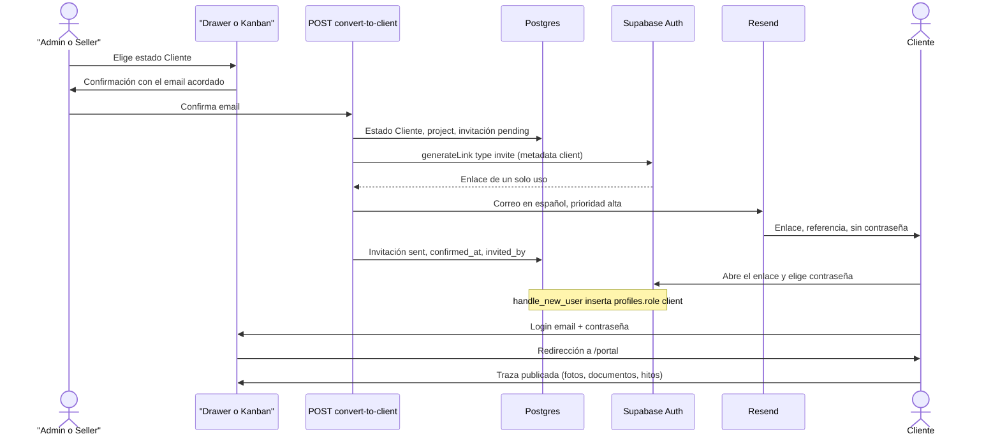

# Portal De Cliente (Traza Del Proyecto) — Requisito Futuro

> **Estado:** propuesto, no implementado · decisiones de producto aprobadas por Ociel el 26 Sep 2026 · **Actualizado:** 2026-09-26
> **No entra en M2.** No presentar como comportamiento actual: no hay rol `client`, ni tablas de proyecto, ni ruta `/portal`, ni invitación por correo.

## 1. Contexto y objetivo

GallaDev Workspace cualifica leads de asesorías y gestorías hasta el estado `Cliente`. Ahí acaba el CRM. Esta especificación describe el paso siguiente, idea de Ociel: cuando un lead pasa a ser cliente, esa persona recibe acceso propio para seguir la traza de su proyecto. El Seller de ese lead (o un Admin) publica el avance (fotos, documentos, comentarios, hitos) y el cliente lo consulta, en solo lectura, en una interfaz distinta de la del equipo interno.

El portal es de la asesoría que GallaDev ha convertido en cliente. Muestra el proyecto que GallaDev le entrega.

### Qué existe hoy

Hechos del código y del esquema. Lo que no está en esta tabla es **PROPOSED**.

| Pieza | Hecho actual |
| --- | --- |
| Auth | Supabase Auth, email + contraseña. Sin alta pública. La puerta de sesión es `src/proxy.ts` (convención `proxy` de Next.js 16; no hay `src/middleware.ts`). Exime `/api/health`, `/api/demo/enter`, `/api/demo/exit` y `/api/ingest/*`. |
| Roles | Enum PostgreSQL `public.app_role`: `Admin`, `Seller`, `Viewer`. Columna `profiles.role`. El tipo de aplicación es `AppRole` en `src/lib/auth.ts`. No hay valor `Editor` ni `client`. |
| Alta de usuarios | Un Admin crea la cuenta en el Dashboard (Authentication → Users). El trigger `on_auth_user_created` llama a `handle_new_user()` e inserta `profiles` con rol `Seller` (`supabase/migrations/20260922000001_profiles_trigger.sql`). |
| RBAC de API | `requireApiSession`, `requireApiRole`, `requireAdmin`, `requireLeadWriter` en `src/lib/api-auth.ts`. Quien no encaja en `isAppRole` recibe HTTP 401 `code: "no_profile"`. Escritura de leads: Admin o Seller. Viewer: 403 `code: "forbidden"`. |
| RLS | Policies `role_leads_*` y `role_activities_*` sobre `leads` y `lead_activities`. Helper `public.current_app_role()`. Seller ve filas con `responsable` nulo o igual a `auth.uid()`. Viewer lee. El borrado de fila es solo Admin; la app archiva (`leads.archived`). |
| Estado ganado | `Cliente` ya existe en el enum `public.lead_status` y en `LEAD_STATUSES` (`src/lib/domain/lead.ts`). Es el octavo estado del pipeline, antes de `Descartado`. El mapa legado traduce `Contratado` → `Cliente`. No hay otro estado "won". |
| Cambio de estado | El `<select>` del drawer (`src/components/leads/lead-drawer.tsx`, `savePatch`) y el arrastre del Kanban (`src/components/kanban/kanban-board.tsx`, `patchStatus`) hacen `PATCH /api/leads/:id` con `{ status }` en el acto. No hay confirmación ni correo. |
| Correos del lead | Columnas `email`, `email_commercial`, `email_manager`. No hay columna para "el email acordado en la reunión". |
| Correo saliente | Resend, solo para la ingesta web: `src/lib/email/resend-client.ts` y `src/lib/email/send-ingest-emails.ts`. Remitente `emailFromClients()` (`EMAIL_FROM_CLIENTS` o `GallaDev <hola@galladev.com>`). Reply-To opcional `EMAIL_REPLY_TO`. Aviso interno `EMAIL_NOTIFY_TO`. Si falta `RESEND_API_KEY`, el envío se omite (fail-open) y el lead se guarda igual. No hay `inviteUserByEmail` ni `generateLink`. |
| Storage | El repo no usa Supabase Storage. No hay buckets. |
| Shell | `src/app/layout.tsx` envuelve todas las páginas en `AppShell`. El menú interno está en `src/components/layout/app-sidebar.tsx` (Dashboard, Daily Work, Leads, Kanban, Statistics, Email, Automations, Duplicados, Settings). |
| Login | `src/app/login/login-form.tsx` llama a `signInWithPassword` y redirige a `from` o a `/`. Puede ofrecer «Entrar como visitante». No hay pantalla de restablecer contraseña. |
| Demo de visitante | Cookie httpOnly `gdw_visitor` (HMAC, 4 horas). No es Admin, Seller ni Viewer. `GET /api/session` devuelve `visitor: true` y `role: null`. Las APIs bloqueadas responden 403 `demo_readonly`. |
| Auditoría | Especificada en [`audit-trail.es.md`](./audit-trail.es.md). La tabla `audit_log` no existe. |
| Cliente admin | `createSupabaseAdminClient()` (`src/lib/supabase/admin.ts`) usa la service role y solo vive en servidor. Hoy el equipo se lista con `sb.auth.admin.listUsers()` en `GET /api/team` (solo Admin). |

## 2. Decisiones aprobadas

Aprobadas por Ociel el 26 Sep 2026. Las cuatro decisiones de abajo enmarcan el diseño; las diez respuestas del mismo día las cierran. El resto del documento las da por buenas y marca **PROPOSED** cada tabla, ruta, policy y job que aún no existe.

1. **Sin contraseña en claro.** El correo lleva un enlace de invitación de un solo uso que caduca (objetivo: 48 horas). Lo acuña Supabase Auth con `generateLink` tipo `invite` y lo entrega Resend (respuesta 8). El cliente elige su contraseña. El email acordado es la identidad de login. `client_id` es una referencia visible (`projects.public_ref`), no un secreto y no sirve para entrar. Hay reenvío. La revocación es solo Admin. El restablecimiento de contraseña lo pueden enviar Admin y Seller.
2. **El disparador es una confirmación, no el cambio de estado a solas.** Cuando un usuario interno pasa un lead a `Cliente`, GDW pide el email acordado (precargado si ya consta, siempre editable) y solo entonces crea el proyecto y envía la invitación. Ese paso queda registrado: quién confirmó y cuándo. Un `PATCH` de estado no envía correo por su cuenta. El orden de precarga es `email`, luego `email_manager`, luego `email_commercial` (respuesta 6).
3. **Aislamiento en Postgres.** En v1 el cliente ve solo su proyecto, el de su lead (respuestas 1 y 2). Lo impone RLS, no solo la UI. El cliente no entra en rutas ni APIs del CRM: `src/proxy.ts` más `requireApiRole`, con 403. Los ficheros viven en un bucket privado y se sirven con URL firmada de vida corta. Cada actualización tiene visibilidad: publicada al cliente, o nota interna. La nota interna no sale en ninguna lectura del rol `client`. El portal es de solo lectura: el cliente no comenta ni aprueba (respuesta 3).
4. **Área propia.** Ruta **PROPOSED** `/portal` con layout mínimo, sin el sidebar de `app-sidebar.tsx`. Tras el login, el rol `client` cae ahí. Admin, Seller y Viewer no ven esa área. Un Admin puede abrir una vista previa «ver como cliente», en solo lectura y con un aviso visible, sin suplantar la sesión del cliente.

### Respuestas de Ociel 26 Sep 2026

1. **Un proyecto por lead.** `projects.lead_id` es único. Un segundo proyecto para el mismo lead no se crea.
2. **Una cuenta por cliente.** Un email de login, un usuario Auth, un `projects.client_user_id`. Si ese email ya es cliente de otro lead, la conversión se rechaza.
3. **Portal en solo lectura.** Sin comentarios ni aprobaciones del cliente en v1. Las notas las escribe el equipo.
4. **Sin correo por cada actualización.** En su lugar, un informe semanal en PDF, por Resend, con preferencia de alta y de baja. Lo detalla la sección 10. El slice es S5.
5. **Cerrado es un acuerdo de las dos partes.** En ese momento un Admin revoca el acceso del cliente y queda registrado quién y cuándo. El cliente no conserva el portal después del cierre.
6. **Precarga del email.** `leads.email`, luego `email_manager`, luego `email_commercial`. El campo sigue siendo editable.
7. **Quién hace qué.** El Seller que puede escribir ese lead publica actualizaciones. Solo un Admin revoca el acceso. El restablecimiento de contraseña lo envían Admin y Seller.
8. **La invitación sale por Resend.** `generateLink` tipo `invite` en el servidor, y el texto lo manda Resend con `emailFromClients()`. La plantilla genérica de Supabase Auth no es el canal. La gestión amplia de emails dentro de GDW queda como placeholder en el roadmap, sin spec.
9. **Supresión total bajo petición.** Se borra el usuario Auth, el perfil, el proyecto, las fases, las actualizaciones, los ficheros (también en Storage), las invitaciones y la fila del lead. Es un `DELETE` de verdad: el archivado (`leads.archived`) sigue siendo el borrado normal del CRM, y este camino es la excepción. Queda solo un registro mínimo, sin email ni nombre, de que hubo una supresión, en `client_access_events` o equivalente, si encaja con la obligación legal. Ese registro es **PROPOSED**.
10. **Ficheros.** Tope de 50 MB por fichero. Cada fichero se borra de la plataforma a las dos semanas de subirlo (job de limpieza, **PROPOSED**). El informe semanal recomienda al cliente descargarlos. Cliente, Seller y Admin tienen botón de descarga (URL firmada). El portal muestra la caducidad («disponible hasta …»). Ociel apuntó que, cuando el almacenamiento se llene, se abriría otro: queda anotado en la sección 9; v1 arranca con un solo bucket y un aviso al 80 % de la cuota.

### Correo: Auth acuña el enlace; Resend lo entrega

Camino aprobado (respuesta 8): `generateLink` (`type: 'invite'`) en el servidor con `createSupabaseAdminClient()`, y el texto en español por Resend, con el remitente que ya existe (`emailFromClients()`). Así el mensaje va en español, con prioridad alta, sin pasar por la plantilla genérica de Auth.

La caducidad de 48 horas es el ajuste de caducidad de enlaces/OTP del proyecto Auth. Ese ajuste cubre invitación y recuperación. El equipo interno sigue dándose de alta en el Dashboard, así que el cambio afecta sobre todo a clientes y a "he olvidado mi contraseña".

La invitación no hereda el fail-open de `sendIngestEmails`. Si el correo no sale, la API no responde éxito.

### El trigger de perfil no puede dejar al cliente como Seller

`handle_new_user()` inserta siempre `Seller`. Un invitado entraría al CRM con permiso de escritura hasta que alguien le cambie el rol, y `isAppRole` rechazaría el valor `client` con 401 `no_profile` hasta que el código lo conozca.

**PROPOSED:** la invitación guarda en `raw_user_meta_data` una marca `app_role = client`. El trigger, en la misma transacción que el alta, inserta `profiles.role = 'client'` cuando ve esa marca, y `Seller` en cualquier otro alta. El mismo cambio de código que añade `'client'` a `AppRole` e `isAppRole` tiene que desplegarse junto con la migración. Hasta ese despliegue no se invita a nadie.

## 3. Usuarios y roles

| Actor | Hoy | Con esta spec |
| --- | --- | --- |
| Admin | Settings, automatizaciones, equipo, escrituras de leads y análisis IA. Lee todo lo que las policies de Admin permiten. | Igual en el CRM. Confirma conversiones, publica, envía restablecimiento, cierra el proyecto, revoca el acceso, ejecuta la supresión y abre la vista previa del portal. Puede descargar ficheros y lanzar el informe semanal. |
| Seller | Escribe leads propios o sin asignar (`responsable`). No toca settings ni `GET /api/team`. | Igual en el CRM. En los leads que puede escribir: confirma la conversión, publica, envía restablecimiento, descarga ficheros y lanza el informe semanal. No revoca, no cierra el proyecto y no ejecuta la supresión. |
| Viewer | Lectura del CRM. Las escrituras responden 403. | Sigue en el CRM, en lectura. Puede leer la traza interna del proyecto. No invita, no sube, no descarga, no abre `/portal`. |
| `client` | No existe. | **PROPOSED.** Solo `/portal` y las APIs de esa área, en solo lectura. Sin CRM. Una cuenta, un proyecto. |
| Visitante demo | Cookie `gdw_visitor`, datos ficticios, sin Supabase. | Sigue igual. `/portal` le redirige a `/leads`, como `/settings`, `/automations` y `/email`. No hay demo del portal en v1. |

El rol sale de `profiles.role`. El email de login vive en `auth.users`, no en `profiles` (`profiles` hoy solo tiene `id`, `role`, `created_at`).

Quién puede pulsar «pasar a cliente»: quien ya puede escribir ese lead (`requireLeadWriter`: Admin o Seller dentro de su RLS). Viewer no.

## 4. Flujo de punta a punta

Estados del lead que importan: el pipeline canónico ya incluye `Cliente`. La conversión es el primer salto a ese estado. Un lead que ya está en `Cliente` (datos anteriores a esta función) puede recibir proyecto e invitación por el mismo paso, sin crear un segundo proyecto si ya hay uno para ese `lead_id`.



Pasos:

1. En el drawer o en el Kanban, elegir `Cliente` abre la confirmación. No llama a `savePatch` ni a `patchStatus` todavía.
2. El campo de email es obligatorio y editable. Precarga aprobada: `leads.email` si tiene pinta de email; si no, `email_manager`; si no, `email_commercial`; si no, vacío. Los otros dos se muestran al lado para que la persona elija el acordado en la reunión.
3. Al confirmar, el servidor (sesión de `requireApiSession`, nunca un actor enviado por el cliente) ejecuta `POST /api/leads/:id/convert-to-client` con `{ email }`.
4. En una transacción: `leads.status = 'Cliente'`, alta de `projects` si no existe para ese `lead_id`, fila `client_invitations` en `pending` con `invited_by` y `confirmed_at = now()`. Se guarda el estado anterior por si hay que compensar.
5. El servidor acuña el enlace y envía el correo. Si Auth no llega a crear el usuario, se revierte el estado del lead y se elimina el proyecto vacío. Si el usuario ya existe y Resend falla, el lead permanece en `Cliente`, la invitación queda `send_failed` y la UI pide reenviar. La respuesta de éxito solo sale cuando el correo fue aceptado.
6. El cliente abre el enlace, fija la contraseña y entra por `/login`. `src/proxy.ts` ve el rol `client` y lo lleva a `/portal`, aunque `from` apunte a `/leads`.
7. A partir de ahí el cliente ve la traza publicada, en solo lectura. El Seller del lead o un Admin sube material y decide qué se publica. El cliente no comenta ni aprueba.
8. Cada semana, si la preferencia está activa, un job **PROPOSED** genera el PDF y Resend lo envía. Admin o Seller del lead también pueden pulsar «enviar reporte ahora».
9. Cerrar el proyecto es un acuerdo de las dos partes. Lo registra un Admin: `projects.status = 'closed'`, revocación del acceso (`revoked_at`, `revoked_by`) y el cliente deja de entrar. No queda un modo de solo lectura posterior al cierre.
10. Una petición de supresión, también Admin, borra los datos de ese cliente (sección 9). No es el archivado habitual del CRM.

Reenvío: nueva fila o la misma invitación actualizada, nuevo enlace, el anterior deja de usarse. Lo pueden hacer Admin y Seller del lead. Revocación: solo Admin; el acceso queda cerrado y queda `revoked_at` / `revoked_by`. Restablecimiento: Admin o Seller; enlace de recuperación de Supabase (`generateLink` tipo `recovery`), mismo criterio de correo por Resend, sin contraseña en claro. El login actual no tiene ese enlace; la pantalla es **PROPOSED**, y el equipo también puede dispararlo desde el lead. Un Seller que llama a revocar o a suprimir recibe 403.

`PATCH /api/leads/:id` con `status: "Cliente"` cuando el lead aún no está en `Cliente` responde **PROPOSED** 409 `client_conversion_required` y no escribe el estado. Así un cliente de API o un arrastre a medias no dispara nada en silencio. Los demás estados siguen por el PATCH de hoy.

La demo de visitante no llama a este endpoint (`demo_readonly`).

## 5. Modelo de datos propuesto

Todo este apartado es **PROPOSED**. No hay migración en el repo. Nombres nuevos, anclados a columnas que sí existen (`leads.id`, `leads.status`, `profiles.id`, `auth.users`).

`client_id` de cara al cliente es `projects.public_ref`: único, legible, mostrado en el portal y en el correo. Formato propuesto: `GDW-` más 8 caracteres (alfabeto sin ambiguos). No es el `uuid` de Auth ni una contraseña.

Un lead tiene un proyecto (`UNIQUE (lead_id)`). Una cuenta de cliente tiene un proyecto (`UNIQUE (client_user_id)` cuando ya no es nulo). Varios proyectos por persona, o varias personas por proyecto, quedan fuera de v1.

```sql
-- PROPOSED — boceto, no es una migración. No aplicar tal cual.

ALTER TYPE public.app_role ADD VALUE IF NOT EXISTS 'client';

CREATE TABLE public.projects (
  id uuid PRIMARY KEY DEFAULT gen_random_uuid(),
  public_ref text NOT NULL UNIQUE,
  lead_id uuid NOT NULL UNIQUE REFERENCES public.leads(id) ON DELETE CASCADE,
  client_user_id uuid NULL UNIQUE REFERENCES public.profiles(id) ON DELETE SET NULL,
  title text NOT NULL,
  status text NOT NULL DEFAULT 'active', -- active | closed
  closed_at timestamptz NULL,
  closed_by uuid NULL REFERENCES public.profiles(id),
  created_by uuid NOT NULL REFERENCES public.profiles(id),
  created_at timestamptz NOT NULL DEFAULT now(),
  updated_at timestamptz NOT NULL DEFAULT now()
);

-- Preferencia del informe semanal. Por defecto apagada (opt-in).
CREATE TABLE public.project_report_preferences (
  project_id uuid PRIMARY KEY REFERENCES public.projects(id) ON DELETE CASCADE,
  enabled boolean NOT NULL DEFAULT false,
  updated_at timestamptz NOT NULL DEFAULT now(),
  updated_by uuid NULL REFERENCES public.profiles(id) ON DELETE SET NULL
);

CREATE TABLE public.project_phases (
  id uuid PRIMARY KEY DEFAULT gen_random_uuid(),
  project_id uuid NOT NULL REFERENCES public.projects(id) ON DELETE CASCADE,
  name text NOT NULL,
  position integer NOT NULL,
  status text NOT NULL DEFAULT 'pending', -- pending | in_progress | done
  progress_pct integer NOT NULL DEFAULT 0 CHECK (progress_pct BETWEEN 0 AND 100),
  updated_at timestamptz NOT NULL DEFAULT now()
);

CREATE TABLE public.project_updates (
  id uuid PRIMARY KEY DEFAULT gen_random_uuid(),
  project_id uuid NOT NULL REFERENCES public.projects(id) ON DELETE CASCADE,
  phase_id uuid NULL REFERENCES public.project_phases(id) ON DELETE SET NULL,
  type text NOT NULL, -- photo | document | comment | milestone
  -- comment lo escribe el equipo. El rol client no inserta filas en v1.
  visibility text NOT NULL DEFAULT 'internal', -- internal | client
  body text,
  author_id uuid NOT NULL REFERENCES public.profiles(id),
  published_at timestamptz NULL,
  created_at timestamptz NOT NULL DEFAULT now()
);

CREATE TABLE public.project_files (
  id uuid PRIMARY KEY DEFAULT gen_random_uuid(),
  project_id uuid NOT NULL REFERENCES public.projects(id) ON DELETE CASCADE,
  update_id uuid NOT NULL REFERENCES public.project_updates(id) ON DELETE CASCADE,
  bucket text NOT NULL DEFAULT 'project-files',
  storage_path text NOT NULL,
  filename text NOT NULL,
  mime_type text NOT NULL,
  size_bytes integer NOT NULL CHECK (size_bytes > 0 AND size_bytes <= 52428800),
  uploaded_by uuid NOT NULL REFERENCES public.profiles(id),
  available_until timestamptz NOT NULL,
  purged_at timestamptz NULL,
  created_at timestamptz NOT NULL DEFAULT now()
);

CREATE TABLE public.client_invitations (
  id uuid PRIMARY KEY DEFAULT gen_random_uuid(),
  project_id uuid NOT NULL REFERENCES public.projects(id) ON DELETE CASCADE,
  lead_id uuid NOT NULL REFERENCES public.leads(id),
  email text NOT NULL,
  previous_status public.lead_status,
  invited_by uuid NOT NULL REFERENCES public.profiles(id),
  confirmed_at timestamptz NOT NULL DEFAULT now(),
  status text NOT NULL DEFAULT 'pending',
  -- pending | sent | send_failed | accepted | revoked | expired
  auth_user_id uuid NULL REFERENCES auth.users(id),
  expires_at timestamptz NOT NULL,
  sent_at timestamptz NULL,
  accepted_at timestamptz NULL,
  revoked_at timestamptz NULL,
  revoked_by uuid NULL REFERENCES public.profiles(id)
);

-- Registro mínimo de invitaciones y de URLs firmadas.
-- audit_log (audit-trail.es.md) sigue sin existir; cuando exista,
-- estos eventos pueden mudarse allí. Hasta entonces esta tabla es la traza.
CREATE TABLE public.client_access_events (
  id uuid PRIMARY KEY DEFAULT gen_random_uuid(),
  actor_id uuid NULL REFERENCES public.profiles(id) ON DELETE SET NULL,
  actor_role public.app_role,
  action text NOT NULL,
  project_id uuid NULL REFERENCES public.projects(id) ON DELETE SET NULL,
  invitation_id uuid NULL REFERENCES public.client_invitations(id) ON DELETE SET NULL,
  created_at timestamptz NOT NULL DEFAULT now()
);
-- La supresión inserta antes action = 'client.erased' con el actor Admin
-- y sin email, nombre, public_ref ni empresa. ON DELETE SET NULL deja
-- esa fila cuando desaparecen proyecto, invitación y perfil del cliente.
```

Visibilidad por defecto: `internal`. Publicar rellena `published_at` y pasa `visibility` a `client`. Una nota interna nunca cambia de visibilidad por un descuido del cliente: el cliente no tiene `UPDATE` ni `INSERT` sobre esas filas. El tipo `comment` es una nota del equipo, publicada o interna.

Bucket **PROPOSED** `project-files`, privado, uno solo en v1. Ruta de objeto: `{project_id}/{file_id}/{nombre saneado}`. El nombre público no autoriza; autoriza la fila más la URL firmada. `available_until` se fija al subir: `created_at` más 14 días. `purged_at` lo rellena el job de limpieza cuando el objeto ya no está en el bucket. El tope de `size_bytes` es 50 MB (52 428 800 bytes).

`project_report_preferences.enabled` nace en `false`. El cliente puede cambiar la de su proyecto; Admin y el Seller del lead también. No hay correo semanal hasta que alguien la active, y se puede volver a apagar.

`projects.title` sale de `leads.company_name` en el alta y se puede editar después. `projects.client_user_id` se rellena cuando Auth ha creado al usuario.

El contacto que ve el cliente sale de columnas ya existentes del lead (`company_name`, `email` acordado, `phone`, `manager`) más el nombre de quien lleva el lead (`responsable` → usuario de Auth). No se copia el análisis IA, el score, las notas del CRM ni `email_body`.

Fases: en v1 la lista nace vacía y el equipo la crea. El porcentaje del proyecto es la media de `progress_pct` de sus fases, o 0 si no hay fases. No hay un catálogo fijo de fases en el código de hoy; inventar uno quedaría fuera de esta spec.

## 6. Políticas RLS propuestas

Boceto **PROPOSED**. RLS activado en todas las tablas nuevas. Mismo criterio que `20260922210000_security_grants.sql`: `REVOKE` a `PUBLIC` y a `anon`; `GRANT` solo a `authenticated` en lo que la policy deja pasar. `anon` no recibe policies. La service role se usa en servidor para acuñar el enlace, no para las lecturas del portal.

Hoy un rol que no aparece en las policies de `leads` no lee filas (RLS deny por defecto). `client` no está en esas policies. Aun así, la migración debe dejar escrito que `client` no entra en `role_leads_*` ni en `role_activities_*`, con un test de que un JWT `client` recibe cero leads. Viewer sigue leyendo el CRM; `client` no hereda ese acceso.

```sql
-- PROPOSED — boceto. current_app_role() ya existe.

ALTER TABLE public.projects ENABLE ROW LEVEL SECURITY;
ALTER TABLE public.project_updates ENABLE ROW LEVEL SECURITY;
ALTER TABLE public.project_files ENABLE ROW LEVEL SECURITY;
-- Igual en project_phases, client_invitations, client_access_events.

-- Cliente: solo sus proyectos.
CREATE POLICY "client_projects_select"
  ON public.projects
  FOR SELECT
  TO authenticated
  USING (
    public.current_app_role() = 'client'
    AND client_user_id = auth.uid()
  );

-- Equipo interno: misma frontera que el lead padre.
CREATE POLICY "staff_projects_select"
  ON public.projects
  FOR SELECT
  TO authenticated
  USING (
    public.current_app_role() = 'Admin'
    OR public.current_app_role() = 'Viewer'
    OR (
      public.current_app_role() = 'Seller'
      AND EXISTS (
        SELECT 1 FROM public.leads l
        WHERE l.id = projects.lead_id
          AND (l.responsable IS NULL OR l.responsable = auth.uid())
      )
    )
  );

-- Actualizaciones publicadas, solo del proyecto propio.
CREATE POLICY "client_updates_select"
  ON public.project_updates
  FOR SELECT
  TO authenticated
  USING (
    public.current_app_role() = 'client'
    AND visibility = 'client'
    AND EXISTS (
      SELECT 1 FROM public.projects p
      WHERE p.id = project_updates.project_id
        AND p.client_user_id = auth.uid()
    )
  );

-- Ficheros: solo si la actualización padre es visible para ese cliente.
CREATE POLICY "client_files_select"
  ON public.project_files
  FOR SELECT
  TO authenticated
  USING (
    public.current_app_role() = 'client'
    AND EXISTS (
      SELECT 1
      FROM public.project_updates u
      JOIN public.projects p ON p.id = u.project_id
      WHERE u.id = project_files.update_id
        AND u.visibility = 'client'
        AND p.client_user_id = auth.uid()
    )
  );
```

El rol `client` no tiene policies de `INSERT` ni `DELETE` en v1, ni `UPDATE` sobre actualizaciones, fases o ficheros. La única escritura suya prevista es la preferencia del informe (`project_report_preferences` de su proyecto). Las escrituras del equipo (Admin, y Seller sobre sus leads) van en policies aparte, con `WITH CHECK` para que un Seller no reasigne el proyecto a un lead ajeno. Publicar es de ese Seller o de Admin. Revocar, cerrar y suprimir no se apoyan en un `UPDATE` abierto al Seller: los endpoints exigen `requireAdmin`. `client_invitations` y `client_access_events`: el cliente no las lee (el email y el historial de accesos son internos). Las escribe el servidor.

La URL firmada de descarga la piden el cliente (fichero publicado de su proyecto), el Seller del lead y un Admin. Viewer no. El servidor comprueba el rol antes de firmar.

Las APIs del portal usan el cliente de sesión (`createSupabaseServerClient`), de modo que RLS se aplica. El patrón ya está en el análisis IA: la petición normal no usa `service_role`.

Storage: el bucket no es público. No hay policy de Storage que entregue objetos a `authenticated` en bruto. La URL firmada la emite el servidor después de comprobar la fila (sesión + RLS). Caducidad propuesta de la URL: 10 minutos. Un cambio a `internal` deja de emitir URLs; las ya emitidas mueren al vencer.

Vista previa de Admin: la sesión sigue siendo Admin. La consulta filtra `visibility = 'client'` en la aplicación y no cambia `auth.uid()`. No es una policy que dé al Admin "ser" el cliente.

APIs del CRM (`/api/leads`, `/api/settings`, `/api/automations`, `/api/team`, ingesta, análisis): `requireApiRole` sin `client`. Respuesta 403 `forbidden`. El visitante sigue en 403 `demo_readonly`.

## 7. UI

La interfaz de producto sigue en español, como el resto del workspace.

### Portal (`/portal`) — PROPOSED

Layout mínimo, fuera de `AppShell`. Hay que bifurcar `src/app/layout.tsx`, que hoy monta el sidebar en todas las rutas.

- Cabecera: nombre del proyecto (`projects.title`) y referencia `public_ref`. Un proyecto, sin selector. Si el Admin ya cerró y revocó, esta pantalla no se resuelve.
- Progreso por fases: nombre, estado (`pending`, `in_progress`, `done`) y `progress_pct`. Barra con la media.
- Timeline de `project_updates` con `visibility = client`, de más reciente a más antigua: hito, comentario del equipo, foto o documento, autor visible (nombre del equipo, no el email interno si no hace falta) y fecha. Sin caja para responder ni para aprobar.
- Galería y documentos: miniaturas, botón de descarga (URL firmada) y la fecha «disponible hasta {available_until}». Tras `purged_at`, el hueco sigue en la timeline con el texto de que el fichero ya no está. Un fichero de una nota interna no aparece.
- Preferencia del informe semanal: interruptor de alta y de baja. Apagado hasta que el cliente o el equipo lo active.
- Datos de contacto: empresa, teléfono del lead si existe, y un correo de GallaDev de respuesta (`EMAIL_REPLY_TO` si está definido; si no, el remitente público). Sin notas de CRM, sin score, sin análisis IA, sin otros leads.
- Vacío: texto claro de que el proyecto existe y aún no hay avances publicados.

El cliente no ve Daily Work, Leads, Kanban, Statistics, Email, Automations, Duplicados ni Settings.

### UI interna — PROPOSED

En el lead con estado `Cliente`, una sección en el drawer (el Kanban sigue siendo el tablero de estados):

- Al soltar en la columna `Cliente` o al elegir ese estado en el `<select>`, modal de confirmación con el email.
- Lista de actualizaciones con el interruptor publicar / ocultar (`visibility`). Publicar: Admin o Seller del lead.
- Alta de foto, documento, comentario o hito, asociada o no a una fase. Cada fichero muestra «disponible hasta …» y un botón de descarga para Admin y Seller. Viewer ve la ficha y no descarga.
- Fases: nombre, orden, estado, porcentaje.
- Acceso del cliente: email, estado de la invitación, cuándo se confirmó y quién (`invited_by`). Reenviar y restablecer contraseña: Admin o Seller. Revocar: solo Admin.
- Cerrar proyecto: solo Admin, como acuerdo de las dos partes. Deja `closed_at` / `closed_by` y revoca el acceso en el mismo gesto.
- Informe semanal: estado de la preferencia y botón «enviar reporte ahora» (Admin o Seller del lead).
- Supresión del cliente: solo Admin, con confirmación explícita. Borra la fila del lead y el resto de datos de ese cliente (sección 9). No es archivar.
- Vista previa «ver como cliente» solo Admin, con banner persistente. Seller y Viewer no tienen el botón.

Errores de envío en la misma sección (`send_failed`), con reintento, sin decir que el correo salió.

## 8. Email de invitación

| Campo | Propuesta |
| --- | --- |
| Idioma | Español. |
| Remitente | `emailFromClients()`: `EMAIL_FROM_CLIENTS` o `GallaDev <hola@galladev.com>`. |
| Reply-To | `EMAIL_REPLY_TO` si existe. |
| Asunto | `GallaDev — acceso a tu proyecto` |
| Prioridad | Alta. Con Resend, cabeceras `X-Priority: 1`, `Importance: high`, `X-MSMail-Priority: High`. |
| Destinatario | Solo el email confirmado en el modal. |
| Secreto | Ninguno. Sin contraseña, sin `SUPABASE_SECRET_KEY`, sin enlaces de otros clientes. |

Cuerpo propuesto:

```text
Hola,

Ya puedes seguir el estado de tu proyecto con GallaDev.

Referencia: {public_ref}
Empresa: {company_name}

Abre este enlace para crear tu contraseña. Caduca en 48 horas y solo puede usarse una vez:
{invite_url}

El enlace es personal. Si no esperabas este mensaje, ignóralo.

Un saludo,
GallaDev
```

La referencia se presenta como dato de seguimiento. La identidad de acceso es el email.

Confidencialidad: el cuerpo no incluye notas, borradores (`email_subject`, `email_body`), score, análisis IA ni el hecho de otros leads. El fallo de envío se registra en servidor sin volcar el enlace en los logs de `route-log` (mismo criterio: sin tokens ni datos de más).

Reenvío y restablecimiento usan la misma voz y el mismo remitente. El de restablecimiento dice que es para elegir una contraseña nueva, no para dar de alta el proyecto otra vez.

## 9. Seguridad y privacidad

Esto es criterio de producto. No es un dictamen jurídico.

- **Base del envío.** El equipo confirma en el modal el email acordado en la reunión. Esa confirmación queda en `client_invitations` (`email`, `invited_by`, `confirmed_at`). No se escribe a otros correos del lead por estar rellenos.
- **Informe semanal.** La invitación es parte del acceso al proyecto. No hay un correo por cada publicación. El PDF semanal solo sale si `project_report_preferences.enabled` es verdadero (sección 10).
- **Aislamiento.** RLS + proxy + `requireApiRole`. La UI es una capa más, no la única. Probar con un JWT `client` contra PostgREST y contra `/api/leads`.
- **Ficheros.** Bucket privado `project-files`. Tope de 50 MB por fichero (52 428 800 bytes), que es también el máximo que el plan Free de Supabase permite configurar como límite global de subida ([File limits](https://supabase.com/docs/guides/storage/uploads/file-limits), [Pricing](https://supabase.com/pricing); consultados el 26 Sep 2026). En Free ese tope no se puede subir; en Pro el tope de plataforma llega a 500 GB, pero el producto se queda en 50 MB. Tipos admitidos: JPEG, PNG, WebP, GIF, PDF, texto plano, DOCX y XLSX. Fuera: SVG, HTML, ejecutables y tipos no listados. El nombre se sanea y el objeto se guarda con id generado. El bucket puede repetir el tope y los tipos en su propia restricción.
- **Caducidad de ficheros.** A los 14 días de `created_at` el objeto sale del bucket. Un job de limpieza **PROPOSED** borra el objeto y rellena `purged_at`. La fila de la actualización permanece para que la timeline pueda decir que el fichero caducó. El portal muestra «disponible hasta …» desde el alta. Cliente, Seller y Admin descargan con URL firmada mientras el objeto exista. Viewer no tiene botón de descarga.
- **Cuota de Storage.** En el plan Free la cuota incluida de ficheros es 1 GB por proyecto; en Pro, 100 GB incluidos ([Pricing](https://supabase.com/pricing)). Otro bucket en el mismo proyecto no amplía esa cuota ni el tope por fichero. Ociel comentó que, cuando el almacenamiento se llene, se abriría uno nuevo: queda anotado, y no es el plan de v1. v1 usa un solo bucket y un aviso al llegar al 80 % de la cuota del plan (visible para Admin y en el log estructurado). Con la limpieza a las dos semanas el volumen debería mantenerse bajo. El repo no fija el plan del proyecto de producción; si ese proyecto es Free, 50 MB y 1 GB son además el techo de la plataforma.
- **URLs.** Firmadas, 10 minutos, emitidas tras autorizar la fila. Cada emisión escribe `client_access_events` (`file.signed_url`) con actor, rol y proyecto. Sin la URL completa en el log.
- **Traza de invitaciones.** Acciones `invitation.confirmed`, `invitation.sent`, `invitation.resent`, `invitation.revoked`, `password_reset.sent`, `project.closed`, `report.sent`, `portal.preview`, `client.erased`. Actor = usuario de sesión. `client.erased` no guarda email, nombre, empresa ni `public_ref`.
- **Cierre.** `closed` significa acuerdo de las dos partes. Un Admin deja `closed_at` / `closed_by`, revoca el acceso y el portal deja de resolverse. No hay acceso de solo lectura después del cierre.
- **Revocación.** Solo Admin. Cierra la sesión práctica (usuario bloqueado o sesiones invalidadas) y pasa la invitación a `revoked`. Los ficheros dejan de firmarse para ese cliente. El Seller recibe 403 si lo intenta.
- **Supresión.** Bajo petición, solo Admin, y distinta de archivar. Orden **PROPOSED**: borrar objetos del bucket de ese proyecto; insertar `client.erased` sin datos personales; `DELETE` de la fila `leads` (el proyecto, las fases, las actualizaciones, los ficheros, las invitaciones y la preferencia caen en cascada); borrar el usuario en Auth (`profiles.id` ya tiene `ON DELETE CASCADE`). El archivado (`leads.archived`) sigue siendo el borrado normal del CRM en el resto de la app. El registro mínimo de la supresión es **PROPOSED** y solo se conserva si encaja con la obligación legal; si no encajara, no se guarda ningún rastro con datos de esa persona.
- **Demo y `AUTH_DISABLED`.** El visitante no entra. `AUTH_DISABLED` sigue fail-closed en producción y, fuera de producción, no debe fabricar un rol `client`.
- **Rate limit.** El reenvío de invitación usa el limitador en memoria ya existente (`src/lib/rate-limit.ts`), con un tope propuesto de 5 envíos por hora y proyecto. Sigue siendo por instancia, como el resto de M2.

## 10. Informe semanal en PDF

Aprobado por Ociel el 26 Sep 2026. No hay un correo cada vez que se publica una actualización. Una vez por semana, si la preferencia está activa, el cliente recibe un PDF por Resend.

El PDF, en español, resume solo lo publicado esa semana: actualizaciones con `visibility = client` y el avance de las fases (`progress_pct` y estado). No incluye notas internas, score, análisis IA ni borradores del CRM. Recomienda descargar los ficheros y lista los que siguen en el bucket con su «disponible hasta …». El PDF va adjunto al correo. No se guarda en `project-files`, así la limpieza de los 14 días no se lo lleva: la copia es la del email. Remitente: `emailFromClients()`. Asunto propuesto: `GallaDev — informe semanal de tu proyecto`.

Preferencia: `project_report_preferences.enabled`, por defecto `false`. El cliente la enciende o la apaga en `/portal`. Admin y el Seller del lead pueden hacer lo mismo desde el drawer. Con el proyecto `closed`, o con la invitación revocada, no se envía.

Quién lo dispara:

- Un job semanal **PROPOSED**. En la app no hay cron. El mecanismo (Vercel Cron, Supabase Cron o un job en Postgres; el enriquecimiento del roadmap ya nombra esas opciones) queda por elegir y no cambia el comportamiento. Hora por defecto **PROPOSED**: lunes 08:00, `Europe/Madrid`.
- Un botón «enviar reporte ahora» para Admin o para el Seller de ese lead. Sirve para no esperar al lunes y para repetir un envío fallido.

El botón no responde éxito si Resend rechaza el mensaje. El job anota `report.sent` o un fallo, sin reintentar en bucle el mismo día, y sin despublicar nada. No reutiliza `sendIngestEmails`. Slice S5.

## 11. Criterios de aceptación

Comprobables cuando exista implementación. Hoy ninguno se cumple, y no debe darse por hecho.

1. El enum `app_role` acepta `client`. Un alta normal del Dashboard sigue creando `Seller`. Una invitación con la marca de cliente crea `client` en la misma transacción. No hay ventana en la que ese usuario sea Seller.
2. `isAppRole('client')` es verdadero. Un `client` que llama a `GET /api/leads`, `PATCH /api/leads/:id`, `GET /api/team` o `GET /api/settings` recibe 403 `forbidden`. Un visitante sobre `/portal` es redirigido a `/leads`.
3. Tras login, `client` acaba en `/portal`. Admin, Seller y Viewer que piden `/portal` acaban en `/`. La vista previa de Admin muestra solo filas `visibility = client` y un banner.
4. Arrastrar a `Cliente` o elegirlo en el drawer abre la confirmación y no envía `PATCH` todavía. `PATCH` directo a `Cliente` desde otro estado responde 409 `client_conversion_required`.
5. Confirmar con un email válido deja el lead en `Cliente`, un solo `projects` para ese `lead_id`, una invitación con `invited_by` y `confirmed_at`, y un correo de Resend cuyo cuerpo no contiene contraseña. El enlace lo acuña `generateLink` tipo `invite`, caduca (ajuste de 48 horas) y no se reutiliza. Un email que ya es cliente de otro lead no crea una segunda cuenta ni un segundo proyecto.
6. Si Resend rechaza el envío, la respuesta no es de éxito y la invitación queda `send_failed`. Reenviar genera otro enlace y otro evento.
7. Revocar es solo Admin: impide un login útil y deja `revoked_by` / `revoked_at`. Un Seller que revoca recibe 403. El restablecimiento, Admin o Seller, envía un enlace de recuperación sin contraseña en claro.
8. Con RLS, el cliente A no lee proyectos, fases, actualizaciones ni ficheros del cliente B. Una fila `internal` no aparece en el `SELECT` del cliente ni en la URL firmada. El cliente no inserta comentarios. Un Seller no lee el proyecto de un lead con `responsable` de otra persona.
9. Subir un fichero fuera de tipo o de más de 50 MB falla. El objeto queda en el bucket privado `project-files`. A los 14 días el job de limpieza lo borra, rellena `purged_at` y la timeline deja de ofrecer descarga. El portal muestra «disponible hasta …» desde el alta. Cliente, Seller y Admin tienen botón de descarga; Viewer no.
10. La vista del portal enseña fases con porcentaje, la timeline publicada, la galería, la caducidad de cada fichero, el interruptor del informe semanal y el contacto, en español, en solo lectura, sin el menú del CRM.
11. Con la preferencia apagada no sale el PDF. Al activarla, el botón «enviar reporte ahora» (Admin o Seller del lead) adjunta un PDF que solo resume actualizaciones `client` y el avance de fases de esa semana, y recomienda descargar los ficheros. Un fallo de Resend no se informa como éxito. El job semanal hace el mismo envío en el hueco previsto.
12. Cerrar el proyecto lo hace un Admin: `status = closed`, `closed_by` / `closed_at`, acceso revocado, y el cliente ya no entra en `/portal`.
13. La supresión, solo Admin, borra usuario Auth, perfil, proyecto, fases, actualizaciones, objetos de Storage, invitaciones, preferencia y la fila `leads`. No archiva. El único rastro posible es `client.erased` sin email ni nombre.
14. Tests automáticos: rol y 403, trigger `client` frente a `Seller`, 409 del PATCH, RLS de visibilidad (publicada frente a interna), ausencia de contraseña en la plantilla, 403 de Seller al revocar, rechazo por encima de 50 MB, y que el PDF no incluye notas `internal`.

## 12. Fuera de alcance en v1

- Meter este trabajo en M2 (CodeQL, E2E de Viewer, rate limit distribuido, `audit_log`).
- Comentarios o aprobación por parte del cliente.
- Un correo por cada publicación. El aviso al cliente es el PDF semanal (sección 10, slice S5).
- Varios usuarios por cliente, o varios proyectos por lead.
- Dejar al cliente dentro del portal después de cerrar el proyecto.
- Abrir otro bucket, u otro proyecto Supabase, cuando se llene el almacenamiento.
- Gestión de emails dentro de la plataforma GDW (placeholder en el roadmap, sin spec).
- Portal dentro de la demo de visitante.
- Facturación, realtime, app móvil, editor de documentos en el navegador.
- Sustituir el correo de ingesta o cambiar su fail-open.
- Implementar el `audit_log` general. v1 solo escribe `client_access_events`.
- Catálogo cerrado de fases de proyecto.

## 13. Puntos aún abiertos

Las diez preguntas del 26 Sep 2026 están respondidas en la sección 2. No queda ninguna de esa lista.

Siguen sin cerrar solo detalles de implementación, marcados **PROPOSED** en el cuerpo. No cambian las decisiones de producto:

- Qué proceso ejecuta el job semanal y el de limpieza a los 14 días (Vercel Cron, Supabase Cron o un job en Postgres). La hora por defecto del informe es el lunes 08:00, `Europe/Madrid`.
- Si el registro `client.erased` se conserva: solo si encaja con la obligación legal, y en ese caso sin datos personales.
- Dónde se pinta el aviso del 80 % de la cuota de Storage (panel de Admin y log estructurado, como propuesta).

## 14. Slices de implementación

Orden propuesto. Tamaño según superficie (migración, API, UI), no según calendario. Ningún slice está planificado en M2.

| Slice | Contenido | Depende de | Tamaño |
| --- | --- | --- | --- |
| S1 | Valor `client` en `app_role`, trigger según metadata, `AppRole` / `isAppRole`, redirecciones en `src/proxy.ts`, layout de `/portal` vacío, RLS que deja al cliente fuera del CRM, tests de 403. | — | Medio. Una migración, proxy, auth y tests. |
| S2 | Modal de confirmación en drawer y Kanban (precarga `email`, luego `email_manager`, luego `email_commercial`), `POST /api/leads/:id/convert-to-client`, tablas `projects` y `client_invitations`, `generateLink` invite + Resend, reenvío, revocación solo Admin, restablecimiento para Admin y Seller, cierre con revocación y supresión en duro. | S1 | Medio. Endpoint, modal y plantilla. |
| S3 | Bucket único `project-files`, tope 50 MB, `project_updates` / `project_files` / fases, `available_until`, subida con visibilidad, descarga para Admin y Seller, job de limpieza a los 14 días (**PROPOSED**), aviso al 80 % de la cuota. | S1 | Grande. Storage, autorización, UI de subida y limpieza. |
| S4 | Portal en solo lectura: timeline, progreso por fases, galería con «disponible hasta …», descarga, contacto y interruptor del informe. URLs firmadas. | S3 | Medio. Lectura y presentación. |
| S5 | Informe semanal en PDF: resumen de lo publicado y del avance de fases, envío por Resend, preferencia opt-in/opt-out (apagada por defecto), job semanal **PROPOSED** y botón «enviar reporte ahora» para Admin y Seller del lead. El PDF recomienda descargar los ficheros. | S4 | Medio. Generación del PDF, preferencia y dos disparadores. |

S2 y S3 pueden avanzar en paralelo después de S1. S4 necesita datos de S3. S5 no bloquea el portal: el cliente ya ve la traza sin el PDF.
