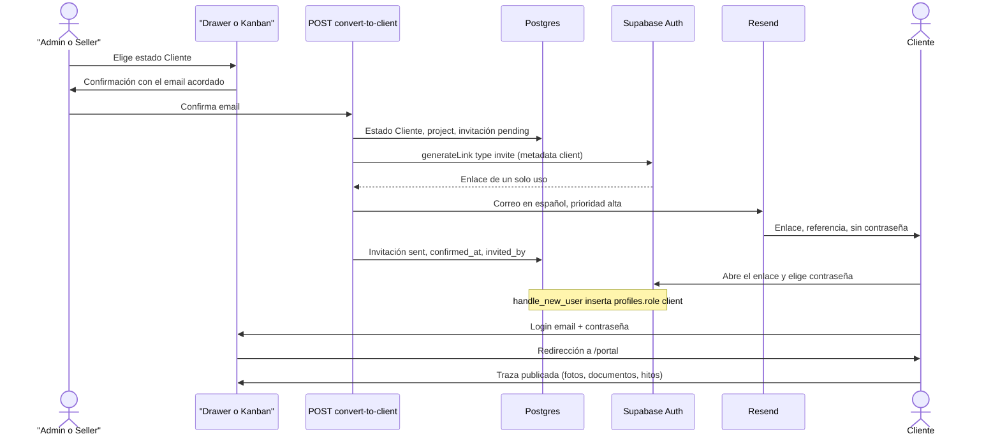

# Portal De Cliente (Traza Del Proyecto) — Requisito Futuro

> **Estado:** propuesto, no implementado · pendiente de validación de Ociel · **Actualizado:** 2026-09-26
> **No entra en M2.** No presentar como comportamiento actual: no hay rol `client`, ni tablas de proyecto, ni ruta `/portal`, ni invitación por correo.

## 1. Contexto y objetivo

GallaDev Workspace cualifica leads de asesorías y gestorías hasta el estado `Cliente`. Ahí acaba el CRM. Esta especificación describe el paso siguiente, idea de Ociel: cuando un lead pasa a ser cliente, esa persona recibe acceso propio para seguir la traza de su proyecto. Ociel publica el avance (fotos, documentos, comentarios, hitos) y el cliente lo consulta en una interfaz distinta de la del equipo interno.

El portal es de la asesoría que GallaDev ha convertido en cliente. Muestra el proyecto que GallaDev le entrega.

### Qué existe hoy

Hechos del código y del esquema. Lo que no está en esta tabla es **PROPOSED**.

| Pieza | Hecho actual |
| --- | --- |
| Auth | Supabase Auth, email + contraseña. Sin alta pública. La puerta de sesión es `src/proxy.ts` (convención `proxy` de Next.js 16; no hay `src/middleware.ts`). Exime `/api/health`, `/api/demo/enter`, `/api/demo/exit` y `/api/ingest/*`. |
| Roles | Enum PostgreSQL `public.app_role`: `Admin`, `Seller`, `Viewer`. Columna `profiles.role`. El tipo de aplicación es `AppRole` en `src/lib/auth.ts`. No hay valor `Editor` ni `client`. |
| Alta de usuarios | Un Admin crea la cuenta en el Dashboard (Authentication → Users). El trigger `on_auth_user_created` llama a `handle_new_user()` e inserta `profiles` con rol `Seller` (`supabase/migrations/20260922000001_profiles_trigger.sql`). |
| RBAC de API | `requireApiSession`, `requireApiRole`, `requireAdmin`, `requireLeadWriter` en `src/lib/api-auth.ts`. Quien no encaja en `isAppRole` recibe HTTP 401 `code: "no_profile"`. Escritura de leads: Admin o Seller. Viewer: 403 `code: "forbidden"`. |
| RLS | Policies `role_leads_*` y `role_activities_*` sobre `leads` y `lead_activities`. Helper `public.current_app_role()`. Seller ve filas con `responsable` nulo o igual a `auth.uid()`. Viewer lee. El borrado de fila es solo Admin; la app archiva (`leads.archived`). |
| Estado ganado | `Cliente` ya existe en el enum `public.lead_status` y en `LEAD_STATUSES` (`src/lib/domain/lead.ts`). Es el octavo estado del pipeline, antes de `Descartado`. El mapa legado traduce `Contratado` → `Cliente`. No hay otro estado "won". |
| Cambio de estado | El `<select>` del drawer (`src/components/leads/lead-drawer.tsx`, `savePatch`) y el arrastre del Kanban (`src/components/kanban/kanban-board.tsx`, `patchStatus`) hacen `PATCH /api/leads/:id` con `{ status }` en el acto. No hay confirmación ni correo. |
| Correos del lead | Columnas `email`, `email_commercial`, `email_manager`. No hay columna para "el email acordado en la reunión". |
| Correo saliente | Resend, solo para la ingesta web: `src/lib/email/resend-client.ts` y `src/lib/email/send-ingest-emails.ts`. Remitente `emailFromClients()` (`EMAIL_FROM_CLIENTS` o `GallaDev <hola@galladev.com>`). Reply-To opcional `EMAIL_REPLY_TO`. Aviso interno `EMAIL_NOTIFY_TO`. Si falta `RESEND_API_KEY`, el envío se omite (fail-open) y el lead se guarda igual. No hay `inviteUserByEmail` ni `generateLink`. |
| Storage | El repo no usa Supabase Storage. No hay buckets. |
| Shell | `src/app/layout.tsx` envuelve todas las páginas en `AppShell`. El menú interno está en `src/components/layout/app-sidebar.tsx` (Dashboard, Daily Work, Leads, Kanban, Statistics, Email, Automations, Duplicados, Settings). |
| Login | `src/app/login/login-form.tsx` llama a `signInWithPassword` y redirige a `from` o a `/`. Puede ofrecer «Entrar como visitante». No hay pantalla de restablecer contraseña. |
| Demo de visitante | Cookie httpOnly `gdw_visitor` (HMAC, 4 horas). No es Admin, Seller ni Viewer. `GET /api/session` devuelve `visitor: true` y `role: null`. Las APIs bloqueadas responden 403 `demo_readonly`. |
| Auditoría | Especificada en [`audit-trail.es.md`](./audit-trail.es.md). La tabla `audit_log` no existe. |
| Cliente admin | `createSupabaseAdminClient()` (`src/lib/supabase/admin.ts`) usa la service role y solo vive en servidor. Hoy el equipo se lista con `sb.auth.admin.listUsers()` en `GET /api/team` (solo Admin). |

## 2. Decisiones propuestas (pendiente OK de Ociel)

Estas cuatro decisiones enmarcan el diseño. Siguen abiertas hasta el OK de Ociel. El resto del documento las da por buenas y marca **PROPOSED** cada tabla, ruta y policy que aún no existe.

1. **Sin contraseña en claro.** El correo lleva un enlace de invitación de un solo uso que caduca (objetivo: 48 horas). Lo acuña Supabase Auth: `inviteUserByEmail` o `generateLink` con tipo `invite`. El cliente elige su contraseña. El email acordado es la identidad de login. `client_id` es una referencia visible (`projects.public_ref`), no un secreto y no sirve para entrar. Hay reenvío, revocación y restablecimiento de contraseña.
2. **El disparador es una confirmación, no el cambio de estado a solas.** Cuando un usuario interno pasa un lead a `Cliente`, GDW pide el email acordado (precargado si ya consta, siempre editable) y solo entonces crea el proyecto y envía la invitación. Ese paso queda registrado: quién confirmó y cuándo. Un `PATCH` de estado no envía correo por su cuenta.
3. **Aislamiento en Postgres.** El cliente ve solo su proyecto (o sus proyectos, si más adelante se admite). Lo impone RLS, no solo la UI. El cliente no entra en rutas ni APIs del CRM: `src/proxy.ts` más `requireApiRole`, con 403. Los ficheros viven en un bucket privado y se sirven con URL firmada de vida corta. Cada actualización tiene visibilidad: publicada al cliente, o nota interna. La nota interna no sale en ninguna lectura del rol `client`. El comentario del cliente queda como pregunta abierta; en v1 el portal es de lectura.
4. **Área propia.** Ruta **PROPOSED** `/portal` con layout mínimo, sin el sidebar de `app-sidebar.tsx`. Tras el login, el rol `client` cae ahí. Admin, Seller y Viewer no ven esa área. Un Admin puede abrir una vista previa «ver como cliente», en solo lectura y con un aviso visible, sin suplantar la sesión del cliente.

### Correo: Auth acuña el enlace; Resend lo entrega

Recomendación de esta spec, también pendiente del OK: usar `generateLink` (`type: 'invite'`) en el servidor con `createSupabaseAdminClient()` y enviar el texto en español por Resend, con el remitente que ya existe (`emailFromClients()`). Así el mensaje puede ir en español, con prioridad alta y sin pasar por la plantilla genérica de Auth.

`inviteUserByEmail` sigue siendo válido si Ociel prefiere la plantilla de Supabase (Authentication → Email Templates). Esa plantilla tendría que estar en español. En ese camino Resend no interviene y las cabeceras de prioridad alta no salen de esta app.

La caducidad de 48 horas es el ajuste de caducidad de enlaces/OTP del proyecto Auth. Ese ajuste cubre invitación y recuperación. El equipo interno sigue dándose de alta en el Dashboard, así que el cambio afecta sobre todo a clientes y a "he olvidado mi contraseña".

La invitación no hereda el fail-open de `sendIngestEmails`. Si el correo no sale, la API no responde éxito.

### El trigger de perfil no puede dejar al cliente como Seller

`handle_new_user()` inserta siempre `Seller`. Un invitado entraría al CRM con permiso de escritura hasta que alguien le cambie el rol, y `isAppRole` rechazaría el valor `client` con 401 `no_profile` hasta que el código lo conozca.

**PROPOSED:** la invitación guarda en `raw_user_meta_data` una marca `app_role = client`. El trigger, en la misma transacción que el alta, inserta `profiles.role = 'client'` cuando ve esa marca, y `Seller` en cualquier otro alta. El mismo cambio de código que añade `'client'` a `AppRole` e `isAppRole` tiene que desplegarse junto con la migración. Hasta ese despliegue no se invita a nadie.

## 3. Usuarios y roles

| Actor | Hoy | Con esta spec |
| --- | --- | --- |
| Admin | Settings, automatizaciones, equipo, escrituras de leads y análisis IA. Lee todo lo que las policies de Admin permiten. | Igual en el CRM. Confirma conversiones, publica actualizaciones, revoca acceso y abre la vista previa del portal. |
| Seller | Escribe leads propios o sin asignar (`responsable`). No toca settings ni `GET /api/team`. | Igual en el CRM. Puede confirmar la conversión y publicar en los proyectos de esos leads. |
| Viewer | Lectura del CRM. Las escrituras responden 403. | Sigue en el CRM, en lectura. Puede leer la traza interna del proyecto. No invita, no sube, no abre `/portal`. |
| `client` | No existe. | **PROPOSED.** Solo `/portal` y las APIs de esa área. Sin CRM. |
| Visitante demo | Cookie `gdw_visitor`, datos ficticios, sin Supabase. | Sigue igual. `/portal` le redirige a `/leads`, como `/settings`, `/automations` y `/email`. No hay demo del portal en v1. |

El rol sale de `profiles.role`. El email de login vive en `auth.users`, no en `profiles` (`profiles` hoy solo tiene `id`, `role`, `created_at`).

Quién puede pulsar «pasar a cliente»: quien ya puede escribir ese lead (`requireLeadWriter`: Admin o Seller dentro de su RLS). Viewer no.

## 4. Flujo de punta a punta

Estados del lead que importan: el pipeline canónico ya incluye `Cliente`. La conversión es el primer salto a ese estado. Un lead que ya está en `Cliente` (datos anteriores a esta función) puede recibir proyecto e invitación por el mismo paso, sin crear un segundo proyecto si ya hay uno para ese `lead_id`.



Pasos:

1. En el drawer o en el Kanban, elegir `Cliente` abre la confirmación. No llama a `savePatch` ni a `patchStatus` todavía.
2. El campo de email es obligatorio y editable. Precarga **PROPOSED**: `leads.email` si tiene pinta de email; si no, `email_manager`; si no, `email_commercial`; si no, vacío. Los otros dos se muestran al lado para que la persona elija el acordado en la reunión.
3. Al confirmar, el servidor (sesión de `requireApiSession`, nunca un actor enviado por el cliente) ejecuta `POST /api/leads/:id/convert-to-client` con `{ email }`.
4. En una transacción: `leads.status = 'Cliente'`, alta de `projects` si no existe para ese `lead_id`, fila `client_invitations` en `pending` con `invited_by` y `confirmed_at = now()`. Se guarda el estado anterior por si hay que compensar.
5. El servidor acuña el enlace y envía el correo. Si Auth no llega a crear el usuario, se revierte el estado del lead y se elimina el proyecto vacío. Si el usuario ya existe y Resend falla, el lead permanece en `Cliente`, la invitación queda `send_failed` y la UI pide reenviar. La respuesta de éxito solo sale cuando el correo fue aceptado.
6. El cliente abre el enlace, fija la contraseña y entra por `/login`. `src/proxy.ts` ve el rol `client` y lo lleva a `/portal`, aunque `from` apunte a `/leads`.
7. A partir de ahí el cliente ve la traza publicada. Ociel sube material desde el lead y decide qué se publica.

Reenvío: nueva fila o la misma invitación actualizada, nuevo enlace, el anterior deja de usarse. Revocación: el acceso queda cerrado y queda `revoked_at` / `revoked_by`. Restablecimiento: enlace de recuperación de Supabase (`generateLink` tipo `recovery` o el equivalente de Auth), mismo criterio de correo, sin contraseña en claro. El login actual no tiene ese enlace; la pantalla es **PROPOSED**, y el equipo también puede disparar el restablecimiento desde el lead.

`PATCH /api/leads/:id` con `status: "Cliente"` cuando el lead aún no está en `Cliente` responde **PROPOSED** 409 `client_conversion_required` y no escribe el estado. Así un cliente de API o un arrastre a medias no dispara nada en silencio. Los demás estados siguen por el PATCH de hoy.

La demo de visitante no llama a este endpoint (`demo_readonly`).

## 5. Modelo de datos propuesto

Todo este apartado es **PROPOSED**. No hay migración en el repo. Nombres nuevos, anclados a columnas que sí existen (`leads.id`, `leads.status`, `profiles.id`, `auth.users`).

`client_id` de cara al cliente es `projects.public_ref`: único, legible, mostrado en el portal y en el correo. Formato propuesto: `GDW-` más 8 caracteres (alfabeto sin ambiguos). No es el `uuid` de Auth ni una contraseña.

Un lead tiene como mucho un proyecto en v1 (`UNIQUE (lead_id)`). Un usuario `client` apunta desde `projects.client_user_id`. Varios proyectos por persona, o varias personas por proyecto, están en las preguntas abiertas; el esquema de v1 no los abre.

```sql
-- PROPOSED — boceto, no es una migración. No aplicar tal cual.

ALTER TYPE public.app_role ADD VALUE IF NOT EXISTS 'client';

CREATE TABLE public.projects (
  id uuid PRIMARY KEY DEFAULT gen_random_uuid(),
  public_ref text NOT NULL UNIQUE,
  lead_id uuid NOT NULL UNIQUE REFERENCES public.leads(id),
  client_user_id uuid NULL REFERENCES public.profiles(id),
  title text NOT NULL,
  status text NOT NULL DEFAULT 'active', -- active | closed
  created_by uuid NOT NULL REFERENCES public.profiles(id),
  created_at timestamptz NOT NULL DEFAULT now(),
  updated_at timestamptz NOT NULL DEFAULT now()
);

CREATE TABLE public.project_phases (
  id uuid PRIMARY KEY DEFAULT gen_random_uuid(),
  project_id uuid NOT NULL REFERENCES public.projects(id) ON DELETE CASCADE,
  name text NOT NULL,
  position integer NOT NULL,
  status text NOT NULL DEFAULT 'pending', -- pending | in_progress | done
  progress_pct integer NOT NULL DEFAULT 0 CHECK (progress_pct BETWEEN 0 AND 100),
  updated_at timestamptz NOT NULL DEFAULT now()
);

CREATE TABLE public.project_updates (
  id uuid PRIMARY KEY DEFAULT gen_random_uuid(),
  project_id uuid NOT NULL REFERENCES public.projects(id) ON DELETE CASCADE,
  phase_id uuid NULL REFERENCES public.project_phases(id) ON DELETE SET NULL,
  type text NOT NULL, -- photo | document | comment | milestone
  visibility text NOT NULL DEFAULT 'internal', -- internal | client
  body text,
  author_id uuid NOT NULL REFERENCES public.profiles(id),
  published_at timestamptz NULL,
  created_at timestamptz NOT NULL DEFAULT now()
);

CREATE TABLE public.project_files (
  id uuid PRIMARY KEY DEFAULT gen_random_uuid(),
  project_id uuid NOT NULL REFERENCES public.projects(id) ON DELETE CASCADE,
  update_id uuid NOT NULL REFERENCES public.project_updates(id) ON DELETE CASCADE,
  bucket text NOT NULL DEFAULT 'project-files',
  storage_path text NOT NULL,
  filename text NOT NULL,
  mime_type text NOT NULL,
  size_bytes integer NOT NULL CHECK (size_bytes > 0),
  uploaded_by uuid NOT NULL REFERENCES public.profiles(id),
  created_at timestamptz NOT NULL DEFAULT now()
);

CREATE TABLE public.client_invitations (
  id uuid PRIMARY KEY DEFAULT gen_random_uuid(),
  project_id uuid NOT NULL REFERENCES public.projects(id) ON DELETE CASCADE,
  lead_id uuid NOT NULL REFERENCES public.leads(id),
  email text NOT NULL,
  previous_status public.lead_status,
  invited_by uuid NOT NULL REFERENCES public.profiles(id),
  confirmed_at timestamptz NOT NULL DEFAULT now(),
  status text NOT NULL DEFAULT 'pending',
  -- pending | sent | send_failed | accepted | revoked | expired
  auth_user_id uuid NULL REFERENCES auth.users(id),
  expires_at timestamptz NOT NULL,
  sent_at timestamptz NULL,
  accepted_at timestamptz NULL,
  revoked_at timestamptz NULL,
  revoked_by uuid NULL REFERENCES public.profiles(id)
);

-- Registro mínimo de invitaciones y de URLs firmadas.
-- audit_log (audit-trail.es.md) sigue sin existir; cuando exista,
-- estos eventos pueden mudarse allí. Hasta entonces esta tabla es la traza.
CREATE TABLE public.client_access_events (
  id uuid PRIMARY KEY DEFAULT gen_random_uuid(),
  actor_id uuid NULL REFERENCES public.profiles(id),
  actor_role public.app_role,
  action text NOT NULL,
  project_id uuid NULL REFERENCES public.projects(id),
  invitation_id uuid NULL REFERENCES public.client_invitations(id),
  created_at timestamptz NOT NULL DEFAULT now()
);
```

Visibilidad por defecto: `internal`. Publicar rellena `published_at` y pasa `visibility` a `client`. Una nota interna nunca cambia de visibilidad por un descuido del cliente: el cliente no tiene `UPDATE` sobre esas filas.

Bucket **PROPOSED** `project-files`, privado. Ruta de objeto: `{project_id}/{file_id}/{nombre saneado}`. El nombre público no autoriza; autoriza la fila más la URL firmada.

`projects.title` sale de `leads.company_name` en el alta y se puede editar después. `projects.client_user_id` se rellena cuando Auth ha creado al usuario.

El contacto que ve el cliente sale de columnas ya existentes del lead (`company_name`, `email` acordado, `phone`, `manager`) más el nombre de quien lleva el lead (`responsable` → usuario de Auth). No se copia el análisis IA, el score, las notas del CRM ni `email_body`.

Fases: en v1 la lista nace vacía y el equipo la crea. El porcentaje del proyecto es la media de `progress_pct` de sus fases, o 0 si no hay fases. No hay un catálogo fijo de fases en el código de hoy; inventar uno quedaría fuera de esta spec.

## 6. Políticas RLS propuestas

Boceto **PROPOSED**. RLS activado en todas las tablas nuevas. Mismo criterio que `20260922210000_security_grants.sql`: `REVOKE` a `PUBLIC` y a `anon`; `GRANT` solo a `authenticated` en lo que la policy deja pasar. `anon` no recibe policies. La service role se usa en servidor para acuñar el enlace, no para las lecturas del portal.

Hoy un rol que no aparece en las policies de `leads` no lee filas (RLS deny por defecto). `client` no está en esas policies. Aun así, la migración debe dejar escrito que `client` no entra en `role_leads_*` ni en `role_activities_*`, con un test de que un JWT `client` recibe cero leads. Viewer sigue leyendo el CRM; `client` no hereda ese acceso.

```sql
-- PROPOSED — boceto. current_app_role() ya existe.

ALTER TABLE public.projects ENABLE ROW LEVEL SECURITY;
ALTER TABLE public.project_updates ENABLE ROW LEVEL SECURITY;
ALTER TABLE public.project_files ENABLE ROW LEVEL SECURITY;
-- Igual en project_phases, client_invitations, client_access_events.

-- Cliente: solo sus proyectos.
CREATE POLICY "client_projects_select"
  ON public.projects
  FOR SELECT
  TO authenticated
  USING (
    public.current_app_role() = 'client'
    AND client_user_id = auth.uid()
  );

-- Equipo interno: misma frontera que el lead padre.
CREATE POLICY "staff_projects_select"
  ON public.projects
  FOR SELECT
  TO authenticated
  USING (
    public.current_app_role() = 'Admin'
    OR public.current_app_role() = 'Viewer'
    OR (
      public.current_app_role() = 'Seller'
      AND EXISTS (
        SELECT 1 FROM public.leads l
        WHERE l.id = projects.lead_id
          AND (l.responsable IS NULL OR l.responsable = auth.uid())
      )
    )
  );

-- Actualizaciones publicadas, solo del proyecto propio.
CREATE POLICY "client_updates_select"
  ON public.project_updates
  FOR SELECT
  TO authenticated
  USING (
    public.current_app_role() = 'client'
    AND visibility = 'client'
    AND EXISTS (
      SELECT 1 FROM public.projects p
      WHERE p.id = project_updates.project_id
        AND p.client_user_id = auth.uid()
    )
  );

-- Ficheros: solo si la actualización padre es visible para ese cliente.
CREATE POLICY "client_files_select"
  ON public.project_files
  FOR SELECT
  TO authenticated
  USING (
    public.current_app_role() = 'client'
    AND EXISTS (
      SELECT 1
      FROM public.project_updates u
      JOIN public.projects p ON p.id = u.project_id
      WHERE u.id = project_files.update_id
        AND u.visibility = 'client'
        AND p.client_user_id = auth.uid()
    )
  );
```

El rol `client` no tiene policies de `INSERT`, `UPDATE` ni `DELETE` en v1. Las escrituras del equipo (Admin, y Seller sobre sus leads) van en policies aparte, con `WITH CHECK` para que un Seller no reasigne el proyecto a un lead ajeno. `client_invitations` y `client_access_events`: el cliente no las lee (el email y el historial de accesos son internos). Las escribe el servidor.

Las APIs del portal usan el cliente de sesión (`createSupabaseServerClient`), de modo que RLS se aplica. El patrón ya está en el análisis IA: la petición normal no usa `service_role`.

Storage: el bucket no es público. No hay policy de Storage que entregue objetos a `authenticated` en bruto. La URL firmada la emite el servidor después de comprobar la fila (sesión + RLS). Caducidad propuesta de la URL: 10 minutos. Un cambio a `internal` deja de emitir URLs; las ya emitidas mueren al vencer.

Vista previa de Admin: la sesión sigue siendo Admin. La consulta filtra `visibility = 'client'` en la aplicación y no cambia `auth.uid()`. No es una policy que dé al Admin "ser" el cliente.

APIs del CRM (`/api/leads`, `/api/settings`, `/api/automations`, `/api/team`, ingesta, análisis): `requireApiRole` sin `client`. Respuesta 403 `forbidden`. El visitante sigue en 403 `demo_readonly`.

## 7. UI

La interfaz de producto sigue en español, como el resto del workspace.

### Portal (`/portal`) — PROPOSED

Layout mínimo, fuera de `AppShell`. Hay que bifurcar `src/app/layout.tsx`, que hoy monta el sidebar en todas las rutas.

- Cabecera: nombre del proyecto (`projects.title`), referencia `public_ref`, estado `active` o `closed`.
- Progreso por fases: nombre, estado (`pending`, `in_progress`, `done`) y `progress_pct`. Barra con la media.
- Timeline de `project_updates` con `visibility = client`, de más reciente a más antigua: hito, comentario, foto o documento, autor visible (nombre del equipo, no el email interno si no hace falta) y fecha.
- Galería y documentos: miniaturas y descarga vía URL firmada. Un fichero de una nota interna no aparece.
- Datos de contacto: empresa, teléfono del lead si existe, y un correo de GallaDev de respuesta (`EMAIL_REPLY_TO` si está definido; si no, el remitente público). Sin notas de CRM, sin score, sin análisis IA, sin otros leads.
- Vacío: texto claro de que el proyecto existe y aún no hay avances publicados.
- Varios proyectos: la v1 muestra uno. Si más adelante hay varios, un selector en esta misma cabecera (pregunta abierta).

El cliente no ve Daily Work, Leads, Kanban, Statistics, Email, Automations, Duplicados ni Settings.

### UI interna — PROPOSED

En el lead con estado `Cliente`, una sección en el drawer (el Kanban sigue siendo el tablero de estados):

- Al soltar en la columna `Cliente` o al elegir ese estado en el `<select>`, modal de confirmación con el email.
- Lista de actualizaciones con el interruptor publicar / ocultar (`visibility`).
- Alta de foto, documento, comentario o hito, asociada o no a una fase.
- Fases: nombre, orden, estado, porcentaje.
- Acceso del cliente: email, estado de la invitación, cuándo se confirmó y quién (`invited_by`), botones reenviar, revocar y enviar restablecimiento.
- Vista previa «ver como cliente» solo Admin, con banner persistente. Seller y Viewer no tienen el botón.

Errores de envío en la misma sección (`send_failed`), con reintento, sin decir que el correo salió.

## 8. Email de invitación

| Campo | Propuesta |
| --- | --- |
| Idioma | Español. |
| Remitente | `emailFromClients()`: `EMAIL_FROM_CLIENTS` o `GallaDev <hola@galladev.com>`. |
| Reply-To | `EMAIL_REPLY_TO` si existe. |
| Asunto | `GallaDev — acceso a tu proyecto` |
| Prioridad | Alta. Con Resend, cabeceras `X-Priority: 1`, `Importance: high`, `X-MSMail-Priority: High`. |
| Destinatario | Solo el email confirmado en el modal. |
| Secreto | Ninguno. Sin contraseña, sin `SUPABASE_SECRET_KEY`, sin enlaces de otros clientes. |

Cuerpo propuesto:

```text
Hola,

Ya puedes seguir el estado de tu proyecto con GallaDev.

Referencia: {public_ref}
Empresa: {company_name}

Abre este enlace para crear tu contraseña. Caduca en 48 horas y solo puede usarse una vez:
{invite_url}

El enlace es personal. Si no esperabas este mensaje, ignóralo.

Un saludo,
GallaDev
```

La referencia se presenta como dato de seguimiento. La identidad de acceso es el email.

Confidencialidad: el cuerpo no incluye notas, borradores (`email_subject`, `email_body`), score, análisis IA ni el hecho de otros leads. El fallo de envío se registra en servidor sin volcar el enlace en los logs de `route-log` (mismo criterio: sin tokens ni datos de más).

Reenvío y restablecimiento usan la misma voz y el mismo remitente. El de restablecimiento dice que es para elegir una contraseña nueva, no para dar de alta el proyecto otra vez.

## 9. Seguridad y privacidad

Esto es criterio de producto. No es un dictamen jurídico.

- **Base del envío.** El equipo confirma en el modal el email acordado en la reunión. Esa confirmación queda en `client_invitations` (`email`, `invited_by`, `confirmed_at`). No se escribe a otros correos del lead por estar rellenos.
- **Consentimiento de avisos posteriores.** La invitación es parte del acceso al proyecto. Un correo por cada actualización publicada es otro tratamiento: queda fuera de v1 y, si se hace, lleva una preferencia explícita (sección 10).
- **Aislamiento.** RLS + proxy + `requireApiRole`. La UI es una capa más, no la única. Probar con un JWT `client` contra PostgREST y contra `/api/leads`.
- **Ficheros.** Bucket privado, tope **PROPOSED** de 20 MB por fichero. Tipos admitidos: JPEG, PNG, WebP, GIF, PDF, texto plano, DOCX y XLSX. Fuera: SVG, HTML, ejecutables y tipos no listados. El nombre se sanea y el objeto se guarda con id generado.
- **URLs.** Firmadas, 10 minutos, emitidas tras autorizar la fila. Cada emisión escribe `client_access_events` (`file.signed_url`) con actor, rol y proyecto. Sin la URL completa en el log.
- **Traza de invitaciones.** Acciones `invitation.confirmed`, `invitation.sent`, `invitation.resent`, `invitation.revoked`, `password_reset.sent`, `portal.preview`. Actor = usuario de sesión.
- **Baja de acceso.** Revocar cierra la sesión práctica (usuario bloqueado o sesiones invalidadas) y pasa la invitación a `revoked`. El portal deja de resolver el proyecto. Los ficheros dejan de firmarse.
- **Supresión.** Bajo petición: borrar el usuario en Auth (el `ON DELETE CASCADE` de `profiles` ya existe para `profiles.id`), borrar objetos del bucket de ese proyecto y sustituir el email de `client_invitations` por un marcador de borrado. El lead se archiva (`archived`), que es el borrado de producto ya vigente; los campos de contacto (`email`, `email_commercial`, `email_manager`, `phone`) se vacían en esa petición. Conservar el lead como ficha comercial sin datos de contacto es la opción por defecto si solo se revoca el acceso y nadie pidió supresión.
- **Retención.** Con el proyecto `active`, los ficheros se quedan. Al pasar a `closed`, v1 no borra solo: siguen visibles en el portal hasta una baja o hasta la regla que Ociel fije (pregunta abierta).
- **Demo y `AUTH_DISABLED`.** El visitante no entra. `AUTH_DISABLED` sigue fail-closed en producción y, fuera de producción, no debe fabricar un rol `client`.
- **Rate limit.** El reenvío de invitación usa el limitador en memoria ya existente (`src/lib/rate-limit.ts`), con un tope propuesto de 5 envíos por hora y proyecto. Sigue siendo por instancia, como el resto de M2.

## 10. Notificaciones futuras

**PROPOSED, fuera de v1, pregunta abierta.** Cuando una actualización pasa a `visibility = client`, se podría enviar un correo corto al cliente («hay una novedad en tu proyecto», enlace a `/portal`, sin el cuerpo de las notas internas). Mismo remitente Resend. Preferencia desactivada hasta que el cliente, o Ociel en su nombre, la active.

No reutiliza el acuse de ingesta (`sendIngestEmails`). Si se construye, el fallo del correo no despublica la actualización (ahí sí cabe fail-open, porque el dato ya está en el portal). Slice S5.

## 11. Criterios de aceptación

Comprobables cuando exista implementación. Hoy ninguno se cumple, y no debe darse por hecho.

1. El enum `app_role` acepta `client`. Un alta normal del Dashboard sigue creando `Seller`. Una invitación con la marca de cliente crea `client` en la misma transacción. No hay ventana en la que ese usuario sea Seller.
2. `isAppRole('client')` es verdadero. Un `client` que llama a `GET /api/leads`, `PATCH /api/leads/:id`, `GET /api/team` o `GET /api/settings` recibe 403 `forbidden`. Un visitante sobre `/portal` es redirigido a `/leads`.
3. Tras login, `client` acaba en `/portal`. Admin, Seller y Viewer que piden `/portal` acaban en `/`. La vista previa de Admin muestra solo filas `visibility = client` y un banner.
4. Arrastrar a `Cliente` o elegirlo en el drawer abre la confirmación y no envía `PATCH` todavía. `PATCH` directo a `Cliente` desde otro estado responde 409 `client_conversion_required`.
5. Confirmar con un email válido deja el lead en `Cliente`, un solo `projects` para ese `lead_id`, una invitación con `invited_by` y `confirmed_at`, y un correo cuyo cuerpo no contiene contraseña. El enlace caduca (ajuste de 48 horas) y no se reutiliza.
6. Si Resend rechaza el envío, la respuesta no es de éxito y la invitación queda `send_failed`. Reenviar genera otro enlace y otro evento.
7. Revocar impide un login útil y deja `revoked_by` / `revoked_at`. El restablecimiento envía un enlace de recuperación sin contraseña en claro.
8. Con RLS, el cliente A no lee proyectos, fases, actualizaciones ni ficheros del cliente B. Una fila `internal` no aparece en el `SELECT` del cliente ni en la URL firmada. Un Seller no lee el proyecto de un lead con `responsable` de otra persona.
9. Subir un fichero fuera de tipo o de más de 20 MB falla. El objeto queda en el bucket privado `project-files`.
10. La vista del portal enseña fases con porcentaje, la timeline publicada, la galería y el contacto, en español, sin el menú del CRM.
11. Tests automáticos: rol y 403, trigger `client` frente a `Seller`, 409 del PATCH, RLS de visibilidad (publicada frente a interna) y ausencia de contraseña en la plantilla del correo.

## 12. Fuera de alcance en v1

- Meter este trabajo en M2 (CodeQL, E2E de Viewer, rate limit distribuido, `audit_log`).
- Comentarios o aprobación por parte del cliente.
- Aviso por correo en cada publicación (sección 10, slice S5).
- Varios usuarios por cliente, o varios proyectos por lead, hasta respuesta de Ociel.
- Caducidad automática del acceso al cerrar el proyecto.
- Portal dentro de la demo de visitante.
- Facturación, realtime, app móvil, editor de documentos en el navegador.
- Sustituir el correo de ingesta o cambiar su fail-open.
- Implementar el `audit_log` general. v1 solo escribe `client_access_events`.
- Catálogo cerrado de fases de proyecto.

## 13. Preguntas abiertas para Ociel

1. ¿Un mismo cliente (un email) puede tener varios proyectos, por ejemplo si dos leads distintos cierran con la misma persona?
2. ¿Hacen falta varios usuarios por cliente (socios de la asesoría) o basta una cuenta?
3. ¿El cliente puede comentar, y llega a aprobar un hito, o el portal se queda en lectura?
4. ¿Avisamos por correo cada vez que se publica una actualización, o el cliente entra cuando quiere?
5. Cuando el proyecto pasa a cerrado, ¿el acceso sigue, pasa a solo lectura, o se revoca al cabo de un plazo?
6. ¿La precarga del email (`email`, luego `email_manager`, luego `email_commercial`) coincide con el que se acuerda en la reunión?
7. ¿Quién más, además de Ociel, puede publicar y revocar: cualquier Seller del lead, o solo Admin?
8. ¿El enlace lo enviamos por Resend (recomendado aquí) o por la plantilla de Supabase Auth?
9. En una petición de supresión, ¿se archiva el lead y se vacían los contactos, o se conserva la ficha comercial intacta y solo se cierra el portal?
10. ¿Hay un tope de tamaño o unos tipos de fichero distintos de los propuestos (20 MB; imágenes, PDF, texto, DOCX, XLSX)?

## 14. Slices de implementación

Orden propuesto. Tamaño según superficie (migración, API, UI), no según calendario. Ningún slice está planificado en M2.

| Slice | Contenido | Depende de | Tamaño |
| --- | --- | --- | --- |
| S1 | Valor `client` en `app_role`, trigger según metadata, `AppRole` / `isAppRole`, redirecciones en `src/proxy.ts`, layout de `/portal` vacío, RLS que deja al cliente fuera del CRM, tests de 403. | — | Medio. Una migración, proxy, auth y tests. |
| S2 | Modal de confirmación en drawer y Kanban, `POST /api/leads/:id/convert-to-client`, tablas `projects` y `client_invitations`, enlace Auth, correo Resend, reenvío, revocación y restablecimiento. | S1 | Medio. Endpoint, modal y plantilla. |
| S3 | Bucket `project-files`, `project_updates` / `project_files` / fases, subida con visibilidad, panel interno en el drawer. | S1 | Grande. Storage, autorización y UI de subida. |
| S4 | Portal con timeline, progreso por fases, galería, documentos y contacto. URLs firmadas. | S3 | Medio. Lectura y presentación. |
| S5 | Correo opcional al publicar. Preferencia del cliente. | S3, y el OK de la pregunta 4 | Pequeño. Un envío más, si se aprueba. |

S2 y S3 pueden avanzar en paralelo después de S1. S4 necesita datos de S3. S5 no bloquea el portal.
